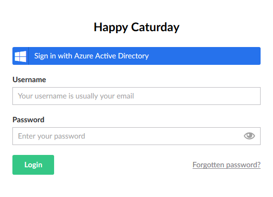

[Back to index](index.md)

## Azure AD / ADFS

Having an integration with an external login provider can really add value
to your application. No longer are users burdened with lots of different usernames,
passwords, and password policies, as a single login can be used to access all sorts
of applications and websites. It makes managing those users also a lot easier.

Since Umbraco uses Owin and ASP.NET Identity, adding an external login provider
to Umbraco is easy. On the marketplace there [are a few options](https://our.umbraco.org/search?q=oauth&cat=project)
available which enable external login providers, using OAuth, to be added to the
back office login. We are going to do something similair, but make it completely
customizable and intergrate it into our custom section. 

### Here be dragons

Getting ADFS and Azure AD integrated into Umbraco can be quite a challenge,
especially when the ADFS server is provided by some external IT service provider. 
We start by using an Azure AD, since we can make and manage that in Azure ourselves, and
the base configuration is good enough to get started.

When troubleshooting the complete login flow in Umbraco, it can be difficult to get
into the internals of Umbraco when using it as a Nuget package. Since it is open source, 
cloning the complete source from GitHub, build it locally, and debugging it can help you pinpoint the problem. 
You will be able to debug all calls and see where thing go wrong, without having to guess what
Umbraco is doing. Cloning and building Umbraco is easy, [if you follow the instruction closely](https://github.com/umbraco/Umbraco-CMS/blob/dev-v7/BUILD.md).

### Running Umbraco on HTTPS

In order to have an external login provider running on our Umbraco, it is wise to have it running
on HTTPS. Start out by setting `umbracoUseSSL` to `true` in the `web.config` `appSettings` node. After
that, create a self-signed certificate using IIS, and add an https binding to the domain of which you have 
created the self-signed certificate.

Browsing to your local Umbraco site using https should look like this:


Browsers do not like it when an https website uses a self-signed certificate, but it works nonetheless.

### Azure AD

After that, go to your Azure portal and add a new Azure AD, or start with your existing one. I have created
a new one using the following settings:


Once created, add a new App Registration:


The sign-on URL is the URL to which the claims token is send when the user logs in. For Umbraco, it is the
root of the backoffice. The `Default` endpoint of the `BackOfficeController` [handles the incoming external login](https://github.com/umbraco/Umbraco-CMS/blob/29fa6061a906df5627d0709266da017092421174/src/Umbraco.Web/Editors/BackOfficeController.cs#L69).

After saving you will see something like this (don't forget to select All Apps, as it won't be listed under
My Apps):


So that's it, that everthing that has to be configured in Azure. The only thing we have to do now is to copy
some endpoints and identifiers and save them for use in `web.config` later.

##### Federation Metadata Endpoint

At the App Registration blade, click on Endpoints. Copy the Federation Metadata Endpoint URL:


##### Relying Party

Go to your App Registration, click on Settings, then Properties. Copy the App ID URI:


##### Federation Server Identifier

Go to your Azure AD and click on Properties. Copy the Directory ID and use it to replace `{id}` in the following uri:

```
https://sts.windows.net/{id}/
```

### ADFS

Setting up an ADFS server instead is more complicated and requires a lot more configration. There is an
[excellent article from 24days](https://24days.in/umbraco-cms/2016/authenticating-with-ad-fs-and-identityextensions/) 
describing the required configurtion for such an ADFS server. It is a good read, even if you will use
an Azure AD instead. It is good to have some understanding on some key concepts and required claims
for Umbraco. 

From Umbraco's point of view, there is no diffence between interfacing with an Azure AD or an ADFS server.
So if you determine the correct Federation Metadata Endpoint, Relying Party and Federation Server Identfier,
you can set up Umbraco in similair fashion.

### Setting up Umbraco

Let's continue with setting up Umbraco for Azure AD (or ADFS). I continue from the code made for 
[Basic Two Factor Authentication](tfa.md). In case you have skipped that, please go back and follow the instructions
in that section, otherwise you will have missed some required code and configuration.

Furthermore, a lot of code featured in this section [was adapted from this 24days article](https://24days.in/umbraco-cms/2016/authenticating-with-ad-fs-and-identityextensions/)
by Frederik Raabye. I have slightly modified the code to make it compatible with Umbraco versions 7.7 and
up.

Before we start, we need to add a NuGet package called `Microsoft.Owin.Security.WsFederation` (version 3.1.0!). 
This allows us to `UseWsFederationAuthentication`. We start by modifying `CustomSectionOwinStartup.cs`, 
modifying its `ConfigureUmbracoAuthentication` method:

```cs
protected override void ConfigureUmbracoAuthentication(IAppBuilder app)
{
    base.ConfigureUmbracoAuthentication(app);

    app.UseTwoFactorSignInCookie(Constants.Security.BackOfficeTwoFactorAuthenticationType, TimeSpan.FromMinutes(5));

    app.UseUmbracoBackOfficeAdfsAuthentication(
        caption: "Azure Active Directory",
        style: "btn-microsoft",
        icon: "fa-windows",

        defaultUserGroups: new[] { "writer" },
        defaultCulture: "en-US");
}
```

This calls an extension method which we need to add. In the folder `Extensions`, add
`AdfsAuthenticationExtensions.cs` with the following code:

```cs
using Microsoft.AspNet.Identity.Owin;
using Microsoft.IdentityModel.Protocols;
using Microsoft.Owin.Security;
using Microsoft.Owin.Security.Notifications;
using Microsoft.Owin.Security.WsFederation;
using Owin;
using System;
using System.Configuration;
using System.Threading.Tasks;
using Umbraco.Core.Models.Identity;
using Umbraco.Web.Security.Identity;
using Constants = Umbraco.Core.Constants;

namespace UmbracoCustomSection.App_Plugins.CustomSection.Extensions
{
    public static class AdfsAuthenticationExtensions
    {
        public static IAppBuilder UseUmbracoBackOfficeAdfsAuthentication(
            this IAppBuilder app,
            string caption = "AD FS",
            string style = "btn-microsoft",
            string icon = "fa-windows",
            string[] defaultUserGroups = null,
            string defaultCulture = "en-GB",
            Action<BackOfficeIdentityUser, ExternalLoginInfo> onAutoLinking = null,
            Func<SecurityTokenValidatedNotification<WsFederationMessage, WsFederationAuthenticationOptions>, Task> onSecurityTokenValidated = null
        )
        {
            var adfsMetadataEndpoint = ConfigurationManager.AppSettings["AdfsMetadataEndpoint"];
            var adfsRelyingParty = ConfigurationManager.AppSettings["AdfsRelyingParty"];
            var adfsFederationServerIdentifier = ConfigurationManager.AppSettings["AdfsFederationServerIdentifier"];

            app.SetDefaultSignInAsAuthenticationType(Constants.Security.BackOfficeExternalAuthenticationType);

            var wsFedOptions = new WsFederationAuthenticationOptions
            {
                Wtrealm = adfsRelyingParty,
                MetadataAddress = adfsMetadataEndpoint,
                SignInAsAuthenticationType = Constants.Security.BackOfficeExternalAuthenticationType,
                Caption = caption
            };

            wsFedOptions.ForUmbracoBackOffice(style, icon);

            wsFedOptions.AuthenticationType = adfsFederationServerIdentifier;

            var autoLinking = new ExternalSignInAutoLinkOptions(
                autoLinkExternalAccount: true,
                defaultUserGroups: defaultUserGroups ?? new[] { "writer" },
                defaultCulture: defaultCulture)
            {
                OnAutoLinking = onAutoLinking
            };

            if (onSecurityTokenValidated != null)
            {
                wsFedOptions.Notifications = new WsFederationAuthenticationNotifications
                {
                    SecurityTokenValidated = onSecurityTokenValidated
                };
            }

            wsFedOptions.SetExternalSignInAutoLinkOptions(autoLinking);

            app.UseWsFederationAuthentication(wsFedOptions);

            return app;
        }
    }
}
```

This method adds a new external login provider for the backoffice of Umbraco, and be customized
to your liking. `caption`, `style` and `icon` allow you to modify the backoffice login button:



The `defaultUserGroup` and `defaultCulture` allow you to set what a new, previously unknown user gets
configured the first time they successfully log in using Azure AD.

The `onAutoLinking` and `onSecurityTokenValidated` methods allow for custom logic when an external user
logs in. More about those two further below.

This method uses those configuration parameters which you have saved previously, and you
need to add them to `appSettings` in `web.config`. 

```xml
<add key="AdfsMetadataEndpoint" value="https://login.microsoftonline.com/{id}/federationmetadata/2007-06/federationmetadata.xml"/>
<add key="AdfsRelyingParty" value="https://{ad}.onmicrosoft.com/{id}"/>
<add key="AdfsFederationServerIdentifier" value="https://sts.windows.net/{id}/"/>
```

When you rebuild Umbraco and restart the website, and go to the backoffice login page, you will be 
greeted by something like this:


Clicking on the blue button will take you to the login page of Azure AD:


If you successfully login with a valid account, you sign into the backoffice, and see something like this:


#### Few gotchas

I will be lying to you if I told you that it would be so easy. There are a few things to mind when
setting this up and getting it to work.

First, if you sign in with and Azure account which happens to have the same email address as an
existing Umbraco user, you will get the following error:


It is not the friendliest of error messages since it displays the STS url instead of the human readable name of
the external login provider, but you will have to log in with the Umbraco login, and then
link your account using the button on the user sidebar. 

Second, do not use the account which you used to create the Azure AD with. That account is semi-federated
by its original AD, and often does not contain the correct information for Umbraco. I have seen accounts with
missing names or missing e-mail addresses. So do yourself a favour and create a new user and use that one
to test with.

Third, the free Azure AD offering does not allow you to modify any of the claims returned in the security
token. For every account except the admin account of the directory, there will be no email address in the
security token. And Umbraco really requires it:


This can be fixed by adding a `onSecurityTokenValided` method which adds the `emailaddress` claim to the identity when
it is missing. The `name` claim so happens to be the emailaddress, and that is always provided by Azure:

```cs
app.UseUmbracoBackOfficeAdfsAuthentication(
    // [..]

    onSecurityTokenValidated: (message) =>
    {
        var emailClaimType = "http://schemas.xmlsoap.org/ws/2005/05/identity/claims/emailaddress";
        var nameClaimType = "http://schemas.xmlsoap.org/ws/2005/05/identity/claims/name";

        var identity = message.AuthenticationTicket.Identity;

        if (!identity.HasClaim(c => c.Type == emailClaimType) && identity.HasClaim(c => c.Type == nameClaimType))
        {
            var nameClaim = identity.Claims.First(c => c.Type == nameClaimType);
            var emailClaim = new Claim(emailClaimType, nameClaim.Value);

            identity.AddClaim(emailClaim);
        }

        return Task.FromResult(0);
    });
```

When an external login does not have an `emailaddress` claim, but it has a `name` claim, it will copy the name
claim to serve as the `emailaddress` claim. If the external login does not even have the `name` claim, it will 
[not be accepted by Umbraco](https://github.com/umbraco/Umbraco-CMS/blob/29fa6061a906df5627d0709266da017092421174/src/Umbraco.Web/Security/Identity/AuthenticationManagerExtensions.cs#L12). 

If you are using Azure AD Premium, you can register an enterprise application which supports SAML based SSO. For enterprise
applications [you can configure token attributes](https://docs.microsoft.com/en-us/azure/active-directory/active-directory-saas-custom-apps).
If you are using your own ADFS server, you can add [the required claim types easily](https://24days.in/umbraco-cms/2016/authenticating-with-ad-fs-and-identityextensions/)
since you manage the configuration yourself. 

#### Intercepting auto linking and user creation

In order to intercept the creation of a new user based upon an external login, and trigger some custom logic,
you have a few options available. The `onAutoLinking` method is called before a new Umbraco user is created.
This allows you to set up some custom properties on the to-be-created user, for example:

```cs
app.UseUmbracoBackOfficeAdfsAuthentication(
    // [..]

    onAutoLinking: (user, externalLogin) =>
    {
        // flag indicating that this new user has been autolinked from an external login
        user.AddRole("autolinked");
    }

    // [..]);
```

Overloading the various methods from `BackOfficeUserManager` in the `CustomBackOfficeUserManager` gives
you the possibilty to do something custom:

```cs
class CustomBackOfficeUserManager : BackOfficeUserManager, IUmbracoBackOfficeTwoFactorOptions
{
    // [..]

    /// <summary>
    /// Called when a new user should be created.
    /// </summary>
    /// <param name="user"></param>
    /// <returns></returns>
    public override async Task<IdentityResult> CreateAsync(BackOfficeIdentityUser user)
    {
        // autolinked users have this role assigned before they are saved
        var isAutolinked = user.Roles.Any(r => r.RoleId == "autolinked");

        var result = await base.CreateAsync(user);

        if (isAutolinked)
        {
            // when a new user is auto linked
        }

        return result;
    }

    /// <summary>
    /// Called when a user adds their external login to their account.
    /// </summary>
    /// <param name="userId"></param>
    /// <param name="login"></param>
    /// <returns></returns>
    public override async Task<IdentityResult> AddLoginAsync(int userId, UserLoginInfo login)
    {
        var result = await base.AddLoginAsync(userId, login);

        if (result.Succeeded && login.LoginProvider == ConfigurationManager.AppSettings["AdfsFederationServerIdentifier"])
        {
            // when an existing user links their account to their external login
        }

        return result;
    }

    /// <summary>
    /// Called when a user removes their external login from their account.
    /// </summary>
    /// <param name="userId"></param>
    /// <param name="login"></param>
    /// <returns></returns>
    public override async Task<IdentityResult> RemoveLoginAsync(int userId, UserLoginInfo login)
    {
        var result = await base.RemoveLoginAsync(userId, login);

        if (result.Succeeded && login.LoginProvider == ConfigurationManager.AppSettings["AdfsFederationServerIdentifier"])
        {
            // when an existing user removes their extenal login from their account
        }

        return result;
    }
}
```