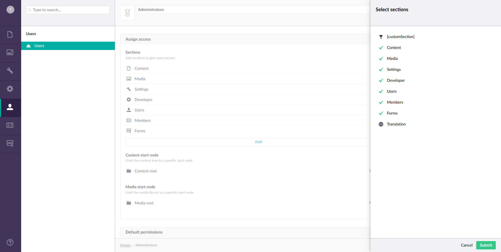

## Basics

Let's start with the basics! Creating a Custom Section. We start with creating a
folder in App_Plugins. In this folder add `CustomApplication.cs`.

```C#
using Umbraco.Core;

namespace UmbracoCustomSection.App_Plugins.CustomSection
{
    public class CustomApplication : IApplicationEventHandler
    {
        public void OnApplicationInitialized(UmbracoApplicationBase umbracoApplication, ApplicationContext applicationContext)
        {
            // here you can setup your DI
        }

        public void OnApplicationStarted(UmbracoApplicationBase umbracoApplication, ApplicationContext applicationContext)
        {
            // this is where you can setup things when the application starts
        }

        public void OnApplicationStarting(UmbracoApplicationBase umbracoApplication, ApplicationContext applicationContext)
        {
            // nothing is really started here yet..
        }
    }
}
```

This enables you to tie into some application events which enables you to setup
some global settings, dependency injection, or check the state of the Umbraco database
and modify things at application start.

To register a custom section to Umbraco, add the following in `CustomSection.cs`:

```C#
using umbraco.businesslogic;
using umbraco.interfaces;

namespace UmbracoCustomSection.App_Plugins.CustomSection
{
    [Application("customSection", "Custom Section", "icon-trophy", -1)]
    public class ForecastSection : IApplication
    {
    }
}
```

This adds a custom section with "customSection" as alias, "Custom Section" as title, a 
trophy icon, and above all other sections. Build Umbraco and restart the site. If you open
the User Groups page you should see the new section:



If you allow Administrators access to the custom section, you should see the following:


The custom section is also added to `config/applications.config`, which contains the configuration
of all sections in Umbraco. In this file you can also change the sortOrder of all sections, if you
want to place your section between other sections. 

To get rid of those angle brackets you need to update the language files situated in `Umbraco/config/Lang`,
and add the following to en.xml, and any other file, to the `<area alias="sections">` :

```xml
<key alias="customSection">Custom Section</key>
```

The backoffice should look like this now:


## Next

Now that we have a custom section and can allow users access to them using User Group configuration, 
we should probably fill it with something usefull. Let's continue creating a [nice tree for our section](tree.md).