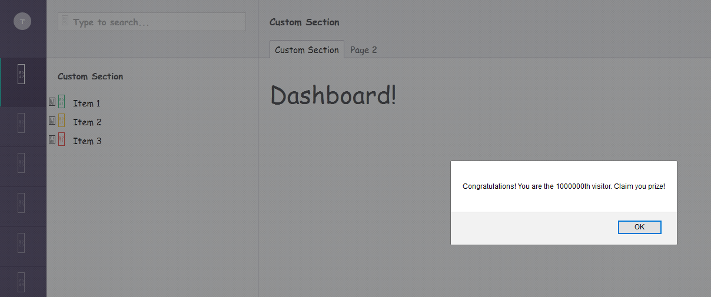
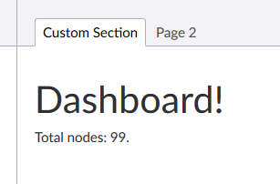
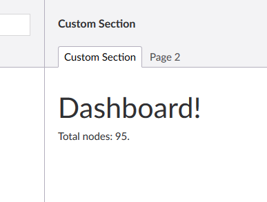

[Back to custom pages overview](custom.md)

## Angular

In order to get our Angular controllers, directives, helpers, and anything else 
included in the Umbraco backoffice, we need to add a manifest to the root of our 
custom section. This file, named `package.manifest` contains all javascript and 
css files included in our custom section.

An empty `package.manifest` looks like this:

``` json
{
  "javascript": [
    
  ],
  "css": [

  ]
}
```

To include a javascript or a style sheet, specify its full path starting
with a tilde:

``` json
{
    "javascript": [
        "~/App_Plugins/CustomSection/backoffice/controllers/dashboard-controller.js"
    ],
    "css": [
        "~/App_Plugins/CustomSection/backoffice/assets/admin.css"
    ]
}
```

After you rebuild and restart the website, any javascript and css will be applied 
and executed:



Keep in mind that Umbraco 7.x is still running Angular 1.1.5, which is an ancient version
of Angular. They do plan on upgrading it to 1.6 in the 8.0 release of Umbraco.

### Dashboard controller

Adding a controller is quite easy, you just have to register a controller to the `umbraco`
module in javascript, and reference the controller in your html view using `ng-controller`:

``` js
(function (angular) {
    'use strict';

    angular.module('umbraco').controller('DashboardController', DashboardController);

    function DashboardController() {

        this.nodeCount = 99;

    }

})(angular);
```

``` html
<div ng-controller="DashboardController as dashboard">
    <h1>Dashboard!</h1>
    <p>Total nodes: {{dashboard.nodeCount}}.</p>
</div>
```

This will result in something like this:



### API Service

To provide this controller with some real data, we need to have it communicate to an API
controller. To do this, first add a new `service`, which will communicate to the backoffice
API controller:

``` js
(function (angular) {
    'use strict';

    angular.module('umbraco.services').factory('dashboardService', DashboardService);

    function DashboardService() {
        return {
            getNodeCount: function () {
                return 95;
            }
        };
    }
})(angular);
```

Don't forget to add it to the `package.manifest` file. After that, update the dashboard 
controller:

``` js
(function (angular) {
    'use strict';

    angular.module('umbraco').controller('DashboardController', DashboardController);

    function DashboardController(dashboardService) {

        this.nodeCount = dashboardService.getNodeCount();

    }

})(angular);
```

Since dependency injection already works in Angular, the custom dashboards shows the following
after building and restarting the site:



Updating the service to have it make an API call will result in the following:

``` js
(function (angular) {
    'use strict';

    angular.module('umbraco.services').factory('dashboardService', DashboardService);

    function DashboardService($http, $q) {
        return {
            getNodeCount: function () {
                var url = 'backoffice/CustomSection/Dashboard/GetNodeCount';

                return $http.get(url)
                    .then(
                    function (response) {
                        return response.data;
                    },
                    function (error) {
                        return $q.reject(error);
                    });
            }
        };
    }
})(angular);
```

This performs a simple GET call to the `DashboardController`'s `GetNodeCount` method. The
url to any HTTP call to an API controller always starts with `backoffice/`, followed by 
the section's name (`CustomSection`), after that the controller and action. This routing is
managed by Umbraco and automatically setup for any controller. The corresponding C# controller
looks like this:

```cs
using Microsoft.EntityFrameworkCore;
using System.Threading.Tasks;
using System.Web.Http;
using Umbraco.Web.Editors;
using Umbraco.Web.Mvc;
using UmbracoCustomSection.App_Plugins.CustomSection.Data;

namespace UmbracoCustomSection.App_Plugins.CustomSection.Controllers
{
    [PluginController("CustomSection")]
    public class DashboardController : UmbracoAuthorizedJsonController
    {
        private readonly CustomSectionDbContext _dbContext;

        public DashboardController(CustomSectionDbContext dbContext)
        {
            _dbContext = dbContext;
        }

        [HttpGet]
        public async Task<int> GetNodeCount()
        {
            return await _dbContext.Nodes.CountAsync();
        }
    }
}
```

This C# controller is derived from `UmbracoAuthorizedJsonController`, which is provided by
Umbraco and is the base of any backoffice API controller. It automatically gets correctly routed
when it has a `PluginController` attribute attached. The controller is comparable to a regular 
API controller, and fully supports dependency injection and `async` methods. 

## Next

Next step is getting all the features in the back office working, starting with a 
[custom search formatter](custom_searchformatter.md).