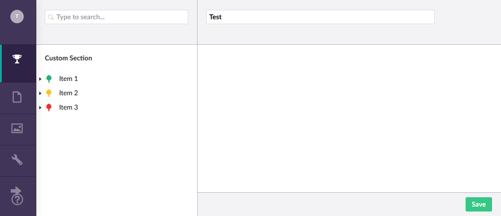

[Back to index](index.md)

## Backoffice controllers and pages

In this last part of the custom pages section I will show you how to create
custom pages and build a completely working custom section, and have every part
work together. 

TODO
- tree
- page
- saving
- context menu create
- context menu sort


First, we start by updating the `GetTreeNodes` method of `TreeController` to include a `RoutePath` to our custom
pages:

```cs
protected override TreeNodeCollection GetTreeNodes(string id, FormDataCollection queryStrings)
{
    var collection = new TreeNodeCollection();

    if (int.TryParse(id, out var parentNodeId))
    {
        var nodes = (id == "-1")
            ? _dbContext.Nodes.Include(n => n.SubNodes).Where(n => n.ParentNode == null).ToList()
            : _dbContext.Nodes.Include(n => n.SubNodes).Where(n => n.ParentNode.Id == parentNodeId).ToList();

        collection.AddRange(nodes.Select(node =>
            CreateTreeNode(
                $"{node.Id}",
                $"{parentNodeId}",
                queryStrings,
                node.Name,
                GetIconForNode(node),
                node.SubNodes?.Any() ?? false,
                $"customSection/customTree/edit/{node.Id}")));
    }

    return collection;
}
```

The `RoutePath` is build up by combining the app alias (`customSection`), the tree alias (`customTree`), and
the name of the page in the `customTree` folder. This path will point to the to-be-created `edit.html` in
the folder `customTree`. Do to the way the tree is working in Umbraco 7.x, it is not possible to get these pages 
into the `views` folder as with the dashboards.

The contents for `edit.html` are for now:

```html
<div ng-controller="EditController as controller">

    <form name="editForm" novalidate val-form-manager>

        <umb-load-indicator ng-show="!controller.node"></umb-load-indicator>

        <umb-editor-view ng-if="controller.node">

            <umb-editor-header name="controller.node.Name" hide-alias="true" hide-description="true" hide-icon="true" />

            <umb-editor-container>
                <umb-tabs-content>
                    <h1>Edit</h1>
                </umb-tabs-content>
            </umb-editor-container>

            <umb-editor-footer>
                <umb-editor-footer-content-right>
                    <umb-button action="controller.save()" label="Save" type="button" button-style="primary" />
                </umb-editor-footer-content-right>
            </umb-editor-footer>

        </umb-editor-view>

    </form>

</div>
```

This is already quite a bit of html, and I use a lot of Umbraco directives, but with good reason. They provide some
basic functionality and let you blend in your custom section perfectly into the rest of Umbraco.

This page also requires a controller called `EditController`, which we will create in `controllers/edit-controller.js`:

```js
(function (angular) {
    'use strict';

    angular.module('umbraco').controller('EditController', EditController);

    function EditController() {

        this.node = { Name: "Test" };

    }
})(angular);
```

Rebuilding and refreshing the site, and then clicking on one of the menu items will yield something like this:



