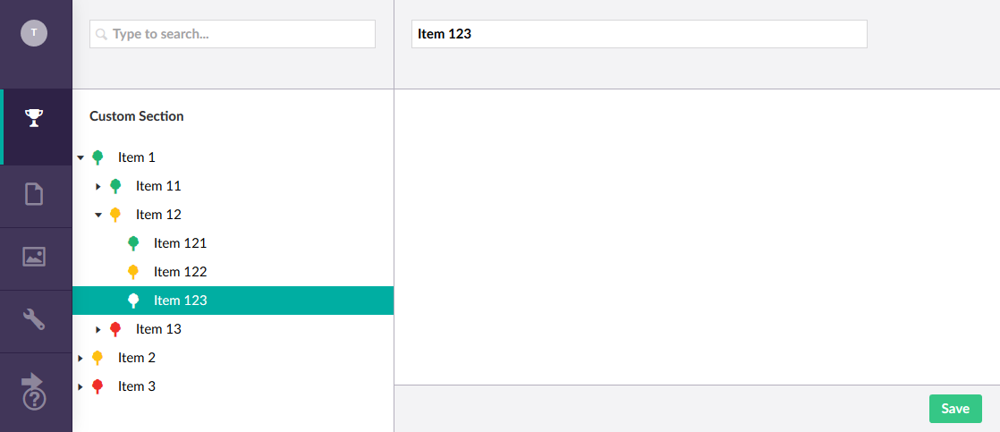

[Back to custom pages overview](custom.md)

## Backoffice controllers and pages

In this last part of the custom pages section I will show you how to create
custom pages and build a completely working custom section, and have every part
work together. 

First, we start by updating the `GetTreeNodes` method of `TreeController` to include a `RoutePath` to our custom
pages:

```cs
protected override TreeNodeCollection GetTreeNodes(string id, FormDataCollection queryStrings)
{
    var collection = new TreeNodeCollection();

    if (int.TryParse(id, out var parentNodeId))
    {
        var nodes = (id == "-1")
            ? _dbContext.Nodes.Include(n => n.SubNodes).Where(n => n.ParentNode == null).ToList()
            : _dbContext.Nodes.Include(n => n.SubNodes).Where(n => n.ParentNode.Id == parentNodeId).ToList();

        collection.AddRange(nodes.Select(node =>
            CreateTreeNode(
                $"{node.Id}",
                $"{parentNodeId}",
                queryStrings,
                node.Name,
                GetIconForNode(node),
                node.SubNodes?.Any() ?? false,
                $"customSection/customTree/edit/{node.Id}")));
    }

    return collection;
}
```

The `RoutePath` is build up by combining the app alias (`customSection`), the tree alias (`customTree`), and
the name of the page in the `customTree` folder. This path will point to the to-be-created `edit.html` in
the folder `customTree`. Due to the way the tree is working in Umbraco 7.x, it is not possible to get these pages 
into the `views` folder as with the dashboards.

The contents for `edit.html`, for now, are:

```html
<div ng-controller="EditController as controller">

    <form name="editForm" novalidate val-form-manager>

        <umb-load-indicator ng-show="!controller.node"></umb-load-indicator>

        <umb-editor-view ng-if="controller.node">

            <umb-editor-header name="controller.node.Name" hide-alias="true" hide-description="true" hide-icon="true" />

            <umb-editor-container>
            </umb-editor-container>

            <umb-editor-footer>
                <umb-editor-footer-content-right>
                    <umb-button action="controller.save()" label="Save" type="button" button-style="primary" />
                </umb-editor-footer-content-right>
            </umb-editor-footer>

        </umb-editor-view>

    </form>

</div>
```

This is already quite a bit of html, and I use a lot of Umbraco directives, but with good reason. They provide some
basic functionality and let you blend in your custom section perfectly into the rest of Umbraco.

This page also requires a controller called `EditController`, which we will create in `controllers/edit-controller.js`:

```js
(function (angular) {
    'use strict';

    angular.module('umbraco').controller('EditController', EditController);

    function EditController() {

        this.node = { Name: "Test" };

    }
})(angular);
```

Rebuilding and refreshing the site, and then clicking on one of the menu items will yield something like this:


I have hidden the icon, alias and description in the header, since I do not need them for this example.

## Saving nodes

To get some real data to this page, first add a new service, called `node-service.js`, which will have the following code:

```js
(function (angular) {
    'use strict';

    angular.module('umbraco.services').factory('nodeService', NodeService);

    function NodeService($http, $q) {
        return {
            getNode: function (id) {
                var url = 'backoffice/CustomSection/Node/GetNode?id=' + id;

                return $http.get(url)
                    .then(
                    function (response) {
                        return response.data;
                    },
                    function (error) {
                        return $q.reject(error);
                    });
            },
            saveNode: function (id, node) {
                var url = 'backoffice/CustomSection/Node/SaveNode';

                return $http.post(url, node)
                    .then(
                    function (response) {
                        return true;
                    },
                    function (error) {
                        return $q.reject(error);
                    });
            }
        };
    }
})(angular);
```

This talks to an `ApiController` called `NodeController` in the back office which handles the request:

```cs
using ExpressMapper.Extensions;
using Microsoft.EntityFrameworkCore;
using System.Threading.Tasks;
using System.Web.Http;
using Umbraco.Web.Editors;
using Umbraco.Web.Mvc;
using UmbracoCustomSection.App_Plugins.CustomSection.Data;
using UmbracoCustomSection.App_Plugins.CustomSection.Models;
using UmbracoCustomSection.App_Plugins.CustomSection.ViewModels;

namespace UmbracoCustomSection.App_Plugins.CustomSection.Controllers
{
    [PluginController("CustomSection")]
    public class NodeController : UmbracoAuthorizedJsonController
    {
        private readonly CustomSectionDbContext _dbContext;

        public NodeController(CustomSectionDbContext dbContext)
        {
            _dbContext = dbContext;
        }

        [HttpGet]
        public async Task<NodeViewModel> GetNode(int id)
        {
            var node = await _dbContext.Nodes
                .Include(n => n.ParentNode).ThenInclude(n => n.ParentNode)
                .FirstOrDefaultAsync(n => n.Id == id);

            return node.Map<Node, NodeViewModel>();
        }

        [HttpPost]
        public async Task SaveNode(NodeViewModel model)
        {
            var node = await _dbContext.Nodes.FirstAsync(n => n.Id == model.Id);

            node.Name = model.Name;

            _dbContext.Update(node);
            await _dbContext.SaveChangesAsync();
        }
    }
}
```

Update `edit-controller.js` with the following code:

```js
(function (angular) {
    'use strict';

    angular.module('umbraco').controller('EditController', EditController);

    function EditController(nodeService, $routeParams, notificationsService, navigationService) {

        var id = $routeParams.id;

        var updateNavigation = function (node) {

            var pathArray = [];

            var currentNode = node;
            while (currentNode != null) {
                pathArray.unshift(currentNode.Id);

                currentNode = currentNode.ParentNode;
            }

            pathArray.unshift('-1');
            
            navigationService.syncTree({ tree: 'customTree', path: pathArray, forceReload: true });
        }

        nodeService.getNode(id).then(function (node) {

            this.node = node;
            updateNavigation(node);

        }.bind(this));

        this.save = function () {
            nodeService.saveNode(id, this.node).then(function () {

                notificationsService.success("The node was saved successfully.");

                updateNavigation(this.node);

            }.bind(this));
        }
    }
})(angular);
```

So lots of changes. Let's discuss a few of them. First, I use the `nodeService` to fetch a `Node` from
the backend, in order to put its name into the textfield. Then, I walk over all `ParentNode`s to get an
array of ids to feed to the `navigationService`s `syncTree` method. This updates the tree and highlights the
corresponding tree element like this:



When the user clicks on the save button, the `save` function is triggered and performs a call to the backend
to update the selected node. It then displays a green `success` notification and updates the tree directly
to display the change:


## Creating nodes

One thing left to implement is the Create method we have defined in the context menu of some of the nodes:

```cs
[..]
else
{
    collection.Items.Add<ActionNew>("Create").NavigateToRoute($"/customSection/customTree/edit/new-{node.Id}");
}
```

So when the user clicks on create, the edit page is displayed with `new-{id}` as id, which we can check for in the
controller:

```js
(function (angular) {
    'use strict';

    angular.module('umbraco').controller('EditController', EditController);

    function EditController(nodeService, $routeParams, notificationsService, navigationService) {

        var createNode = false;

        if ($routeParams.id.indexOf('new-') > -1) {
            createNode = true;
        }

        var id = $routeParams.id.replace('new-', '');

        var updateNavigation = function (node) {

            var pathArray = [];

            var currentNode = node;
            while (currentNode != null && currentNode.Id > 0) {
                pathArray.unshift(currentNode.Id);

                currentNode = currentNode.ParentNode;
            }

            pathArray.unshift('-1');

            navigationService.syncTree({ tree: 'customTree', path: pathArray, forceReload: true });
        }

        if (createNode) {
            nodeService.getNode(id).then(function (node) {

                this.node = { ParentNode: node, Id: 0, Name: "New" };
                updateNavigation(node);

            }.bind(this));
        }
        else {
            nodeService.getNode(id).then(function (node) {

                this.node = node;
                updateNavigation(node);

            }.bind(this));
        }

        this.save = function () {
            if (createNode) {
                nodeService.createNode(id, this.node).then(function (newNode) {

                    this.node = newNode;

                    notificationsService.success("The node was created successfully.");

                    updateNavigation(this.node);

                }.bind(this));
            }
            else {
                nodeService.saveNode(id, this.node).then(function () {

                    notificationsService.success("The node was saved successfully.");

                    updateNavigation(this.node);

                }.bind(this));
            }
        }
    }
})(angular);
```

Adding `createNode` to both the `node-service` and `NodeController` allows us to insert a new 
node:

```js
(function (angular) {
    'use strict';

    angular.module('umbraco.services').factory('nodeService', NodeService);

    function NodeService($http, $q) {
        return {
            // [..]
            createNode: function (id, node) {
                var url = 'backoffice/CustomSection/Node/CreateNode';

                return $http.post(url, node)
                    .then(
                    function (response) {
                        return response.data;
                    },
                    function (error) {
                        return $q.reject(error);
                    });
            }
        };
    }
})(angular);
```

```cs
using ExpressMapper.Extensions;
using Microsoft.EntityFrameworkCore;
using System.Threading.Tasks;
using System.Web.Http;
using Umbraco.Web.Editors;
using Umbraco.Web.Mvc;
using UmbracoCustomSection.App_Plugins.CustomSection.Data;
using UmbracoCustomSection.App_Plugins.CustomSection.Models;
using UmbracoCustomSection.App_Plugins.CustomSection.ViewModels;

namespace UmbracoCustomSection.App_Plugins.CustomSection.Controllers
{
    [PluginController("CustomSection")]
    public class NodeController : UmbracoAuthorizedJsonController
    {
        private readonly CustomSectionDbContext _dbContext;

        public NodeController(CustomSectionDbContext dbContext)
        {
            _dbContext = dbContext;
        }

        // [..]

        [HttpPost]
        public async Task<NodeViewModel> CreateNode(NodeViewModel model)
        {
            var parentNode = await _dbContext.Nodes.FirstAsync(n => n.Id == model.ParentNode.Id);

            var node = new Node
            {
                Id = await _dbContext.Nodes.CountAsync() + 1,
                Name = model.Name,
                ParentNode = parentNode,
                Color = "black"
            };

            _dbContext.Add(node);
            await _dbContext.SaveChangesAsync();

            return await GetNode(node.Id);
        }
    }
}
```

After rebuilding and refreshing Umbraco, we can click on Create to create a new node:


## Next

Now that this is working all correctly, we can reflect a bit on how some of the examples I have
shown. I have tried to demonstrate how to do various things in Umbraco, to make them work with Umbraco,
and how to use some of the features Umbraco provides. But most of these examples are very basic and
simplistic and are not the best practices when building an application in Angular and ASP.NET. It was
not really my goal to demonstrate best practices, but more get you started with custom pages in 
Umbraco, and not to cloud the examples with a lot of Angular and ASP.NET boilerplate. 

That said, let's continue with the last few chapters, starting with [multiple custom sections](sections.md)
in Umbraco, and then improving the login flow using [2FA](tfa.md) and [Azure AD](adfs.md). 