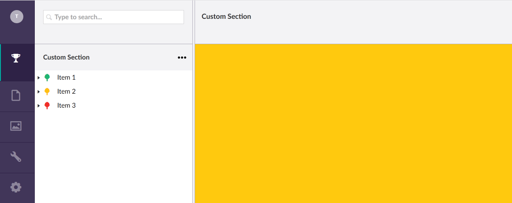
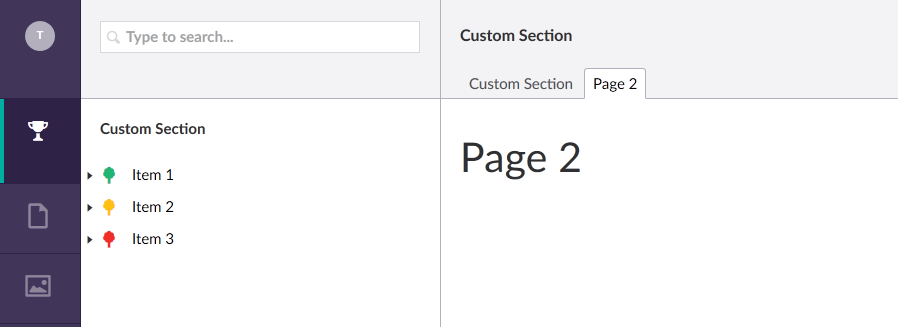

[Back to custom pages overview](custom.md)

## Custom Dashboard

The dashboard of a section is the index of a section; it is the page the user
lands on when they navigate to your section, or click on the root element in the
tree. The header of a dashboard cannot be changed, only the content part (see
the next image). The adjustable part of the dashboard is marked yellow.



To indicate where Umbraco can find the, add the following node to the `section`-node in
`config/Dashboard.config`:

``` xml
<section alias="CustomSection">
    <areas>
        <area>customSection</area>
    </areas>
    <tab caption="Custom Section">
        <control>
        /App_Plugins/CustomSection/backoffice/views/dashboard1.html
        </control>
    </tab>
    <tab caption="Page 2">
        <control>
        /App_Plugins/CustomSection/backoffice/views/dashboard2.html
        </control>
    </tab>
</section>
```

This adds two tabs to dashboard, each pointing to its own `html` file. After creating
these two files, each with a single `h1`-tag in it, saving the configuration file, and
restarting the website, the custom dashboard will look something like this:



## Subject to change

The way dashboards work in Umbraco is probably subject to change in the near future,
since the new User section of Umbraco itself does not use a dashboard. It uses a little trick
to skip the configuration and fully control the whole page. But this requires the use of
a custom tree, and, judging from the code, feels a bit hacky. In next releases this
functionality is probably changed and dashboards are either removed completely, or given
more features. 

## Next

So that is it! Adding a simple, static dashboard to your custom section is quite easy. 
Let's make it more useful by [enabling Angular](custom_angular.md) and get some useful data on our dashboard.