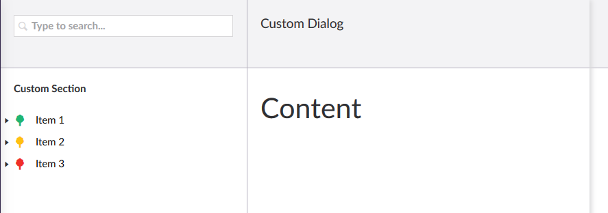
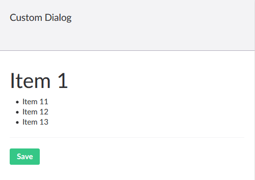

[Back to index](index.md)

## Dialogs

Getting dialogs working with custom content is quite similair to regular pages. First,
we have to instruct Umbraco to load a certain view. Recall that we configured the `TreeController` 
as follows:

```cs
protected override MenuItemCollection GetMenuForNode(string id, FormDataCollection queryStrings)
{
    var collection = new MenuItemCollection();

    if(id == "-1")
    {
        var item = new MenuItem("edit", "Edit");
        item.NavigateToRoute("/some/route");
        collection.Items.Add(item);
    }
    else if(id.Length == 1)
    {
        collection.Items.Add<ActionSort>("Custom Sort").LaunchDialogView("/App_Plugins/CustomSection/backoffice/dialogs/sort.html", "Custom Dialog");
    }
    else if(id.Length == 2)
    {
        collection.Items.Add<ActionNew>("Create").NavigateToRoute($"/customSection/customTree/edit/new-{node.Id}");
    }

    collection.Items.Add<ActionRefresh>("Reload", true);

    return collection;
}
```

So when the user clicks on Custom Sort, Umbraco will try to load `/App_Plugins/CustomSection/backoffice/dialogs/sort.html`
into the dialog. Create `sort.html` file in the `dialogs` folder:

```html
<div class="umb-dialog umb-pane" ng-controller="SortController as controller">
    <h1>{{controller.header}}</h1>

</div>
``` 

After that, create `sort-controller.js` in the `controllers` folder (add it to `package.manifest`) and put the following
code in the file:

```js
(function (angular) {
    'use strict';

    angular.module('umbraco').controller('SortController', SortController);

    function SortController() {

        this.header = "Content";
        
    }
})(angular);
```

Refreshing Umbraco will yield the following when you click on `Sort` in Item 1's context menu:


 
 To add data to the dialog you first have to add a service, `sort-service.js`, to the `services` folder,
 and add the following code:

 ```js
 (function (angular) {
    'use strict';

    angular.module('umbraco.services').factory('sortService', SortService);

    function SortService($http, $q) {
        return {
            getList: function (id) {
                var url = 'backoffice/CustomSection/Sort/GetList?id=' + id;

                return $http.get(url)
                    .then(
                    function (response) {
                        return response.data;
                    },
                    function (error) {
                        return $q.reject(error);
                    });
            }
        };
    }
})(angular);
```

Don't forget to update `package.manifest`. Update `sort-controller` as follows:

```js
(function (angular) {
    'use strict';

    angular.module('umbraco').controller('SortController', SortController);

    function SortController(sortService, $scope, navigationService, treeService) {

        var selectedNode = $scope.dialogOptions.currentNode;
        
        this.header = selectedNode.name;

        sortService.getList(selectedNode.id)
            .then(function (nodes) {
                this.nodes = nodes;
            }.bind(this));

        this.save = function () {

            treeService.loadNodeChildren({ node: $scope.currentNode, section: $scope.currentSection });
            navigationService.hideNavigation();

        };
    }
})(angular);
``` 

Update `sort.html`:

```html
<div class="umb-dialog umb-pane" ng-controller="SortController as controller">
    <h1>{{controller.header}}</h1>

    <ul>
        <li ng-repeat="node in controller.nodes track by $index">{{node.Name}}</li>
    </ul>

    <hr />

    <button class="btn btn-primary" ng-click="controller.save()">Save</button>
</div>
```

Using `$scope.dialogOptions.currentNode` you can get the current selected node for which the 
dialog has been opened. `treeService` lets you interface with the navigational tree, and `navigationService` allows
you to do things like closing the dialog.

To have something answering to the `url` defined in the `sort-service`, add the following BackOffice
controller:

```cs
using Microsoft.EntityFrameworkCore;
using System.Collections.Generic;
using System.Linq;
using System.Threading.Tasks;
using System.Web.Http;
using Umbraco.Web.Editors;
using Umbraco.Web.Mvc;
using UmbracoCustomSection.App_Plugins.CustomSection.Data;
using UmbracoCustomSection.App_Plugins.CustomSection.Models;

namespace UmbracoCustomSection.App_Plugins.CustomSection.Controllers
{
    [PluginController("CustomSection")]
    public class SortController : UmbracoAuthorizedJsonController
    {
        private readonly CustomSectionDbContext _dbContext;

        public SortController(CustomSectionDbContext dbContext)
        {
            _dbContext = dbContext;
        }

        [HttpGet]
        public async Task<List<Node>> GetList(int id)
        {
            return await _dbContext.Nodes.Where(n => n.Id == id).SelectMany(n => n.SubNodes).ToListAsync();
        }
    }
}
``` 

Rebuild Umbraco and restart the site, you should see something similair to this:



## Next

So that is it, this is how you can add custom dialogs to Umbraco. Offcourse, the demonstrated dialog
is not very usefull yet and does not really do anything, but from this basis you can add your own drag and drop
library, and implement a working save method and corresponding API controller.

Next, we will [be creating a working edit page](custom_controllers.md), using quite similair techniques. 