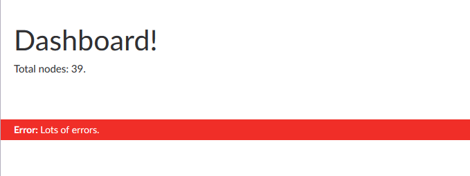

[Back to index](index.md)

## Notifications

Umbraco offers a `notificationsService` which allows you to trigger your own
notifications when some actions finish successfully, or fail. Calling:

```js
notificationsService.success('Success');
```

will yield:


Calling:

```js
notificationsService.error('Error','Lots of errors.');
```

will yield:



This is nice, and will inform your users of simple events, but it is also
possible to add your own custom content to a notification, including buttons
and controllers.

First, we update the dashboard controller to invoke the notification:

```js
(function (angular) {
    'use strict';

    angular.module('umbraco').controller('DashboardController', DashboardController);

    function DashboardController(dashboardService, notificationsService) {

        // [..]
        
        notificationsService.add({
            view: '/App_Plugins/CustomSection/backoffice/notifications/notification.html',
            args: {
                heading: "Sample",
                message: "Some message",
                ok: function () {
                    console.log("OK clicked");
                },
                cancel: function () {
                    console.log("Cancel clicked");
                }
            }
        })
    }
})(angular);
```

In order to display something in this notification, add `notification.html` in the
`notifications` folder, containing:

```html
<div class="notification"ng-controller="NotificationController as notification">
    <h4>\{\{notification.heading\}\}</h4>
    <p>
        \{\{notification.message\}\}
    </p>
    <hr />
    <div class="buttons">
        <button class="btn btn-primary" ng-click="notification.ok()">OK</button>
        <button class="btn" ng-click="notification.cancel()">Cancel</button>
    </div>
</div>
```

This needs an Angular controller in order to work, so we add `notification-controller.js`
in the `controllers` folder (and add it to `package.manifest`), containing:

```js
(function (angular) {
    'use strict';

    angular.module('umbraco').controller('NotificationController', NotificationController);

    function NotificationController($scope, notificationsService) {

        console.log($scope);

        this.notification = $scope.notification;
        this.notificationsService = notificationsService;

        this.heading = $scope.notification.args.heading;
        this.message = $scope.notification.args.message;
        this.ok = function () {
            this.notificationsService.remove(this.notification);

            this.notification.args.ok();
        }.bind(this);
        this.cancel = function () {
            this.notificationsService.remove(this.notification);

            this.notification.args.cancel();
        }.bind(this);
        
    }

})(angular);
```

Refreshing the dashboard will yield something like this:


Custom notifications are sticky by default, so they will not auto-hide after 7 seconds.

That's it, that's all it takes to add custom notifications to your custom section.
If you use them correctly and sparingly, it can really add a level of interactiveness 
to your section.

## Next
Next up is [custom dialogs](custom_dialogs.md).