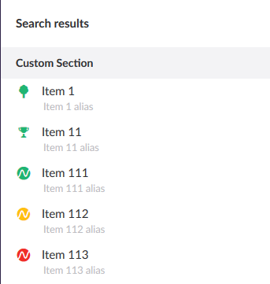

[Back to index](index.md)

## Search formatter

Having Angular setup correctly, it is quite easy to add your own search
formatter. 

First, add update the `CustomTreeController`s `SearchableTree` attribute:

```cs
[SearchableTree("customResultFormatter", "configureResult")]
public class CustomTreeController : TreeController, ISearchableTree
{
    // [..]
}
```

Update the `Search` method so it also adds an `Alias` to every `SearchResultItem`:

```cs
public IEnumerable<SearchResultItem> Search(string query, int pageSize, long pageIndex, out long totalFound, string searchFrom = null)
{
    var results = _dbContext.Nodes.Where(n => n.Name.ToLower().Contains(query.ToLower())).ToList();

    totalFound = results.Count;

    return results.Select(node =>
    {
        var item = new SearchResultItem
        {
            Alias = $"{node.Name} alias",
            Icon = GetIconForNode(node),
            Id = node.Id,
            Name = node.Name,
            ParentId = node.ParentNode?.Id ?? -1,
            Path = GetPathForNode(node),
            Score = node.Name.Intersect(query).Count() / (float)node.Name.Length
        };
        item.AdditionalData.Add("Url", "/some/path");

        return item;
    });
}
```

After that, add `search-formatter-service.js` in the `services` folder, containing
the following code (don't forget adding it to `package.manifest`):

```js
function resultFormatter(umbRequestHelper) {
    
    function configureResult(content, treeAlias, appAlias) {
        content.menuUrl = umbRequestHelper.getApiUrl("contentTreeBaseUrl", "GetMenu", [{ id: content.id }, { application: appAlias }]);
        content.editorPath = appAlias + "/" + treeAlias + "/edit/" + content.id;
        angular.extend(content.metaData, { treeAlias: treeAlias });
        content.subTitle = content.alias;
    }

    return {
        configureResult: configureResult
    };
}

angular.module('umbraco.services').factory('customResultFormatter', resultFormatter);
```

This is a slight modification of [the original formatter](https://github.com/umbraco/Umbraco-CMS/blob/e0025db56d52b770d2b3aedbd48a3b804fd15ef0/src/Umbraco.Web.UI.Client/src/common/services/searchresultformatter.service.js#L9),
and uses the `alias` as sub title instead of `metaData.Url`:



The `content` argument of the `configureResult` formatter function is the
json version of a `SearchResultItem` object, and contains the following
information:

```js
{
    alias: "Item 1 alias",
    icon: "icon-tree color-green",
    id: 1,
    key: "00000000-0000-0000-0000-000000000000",
    metaData: {
        Url: "/some/path"
    },
    name: "Item 1",
    parentId: -1,
    path: "1",
    score: 0,
    trashed: false,
    udi: null
}
```

## TODO

Menu working.

## Next

That's it! Next up is [custom notifications](custom_notifications.md).