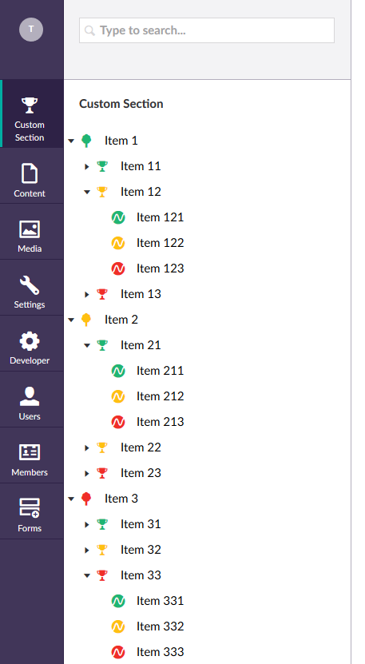
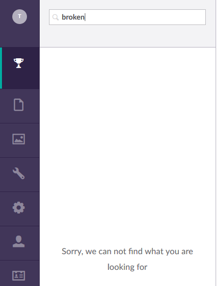

## Dependency Injection

Getting dependency injection working in an Umbraco custom sections
is easy. Umbraco does not force you to use a certain type of DI, so
you can choose anything you want.

We will be using Autofac, and use it to inject a database context
based upon Entity Framework Core into our Api- and TreeControllers. 
Since we replace the default dependency resolvers, we need to keep in
mind that we register all regular and api controllers used by Umbraco.

But first, to get everything working, install these NuGet packages:

- Autofac
- Autofac.Mvc5
- Autofac.WebApi2

And for Entity Framework Core:

- Microsoft.EntityFrameworkCore
- Microsoft.EntityFrameworkCore.InMemory
- Microsoft.EntityFrameworkCore.Relational

We will start by updating the `CustomApplication` class, and add register
some objects to the `ContainerBuilder`:

``` Csharp
public void OnApplicationInitialized(UmbracoApplicationBase umbracoApplication, ApplicationContext applicationContext)
{
	var builder = new ContainerBuilder();
	
	//Register all controllers in Tree name space
	builder.RegisterApiControllers(typeof(CustomTreeController).Assembly);

	//register umbraco MVC + WebApi controllers used by the admin site
	builder.RegisterControllers(typeof(UmbracoApplication).Assembly);
	builder.RegisterApiControllers(typeof(UmbracoApplication).Assembly);

	builder.Register(context =>
	{
		var options = new DbContextOptionsBuilder<CustomSectionDbContext>();
		options.UseInMemoryDatabase(databaseName: "CustomSection");

		var ctx = new CustomSectionDbContext(options.Options);

		CustomSectionDbInitializer.Initialize(ctx);

		return ctx;
	}).InstancePerRequest();

	var container = builder.Build();

	//Set the MVC DependencyResolver
	DependencyResolver.SetResolver(new AutofacDependencyResolver(container));

	//Set the WebApi DependencyResolver
	GlobalConfiguration.Configuration.DependencyResolver = new AutofacWebApiDependencyResolver(container);
}
```

To the `ContainerBuilder` we register all the the `Controllers` we need, the
`CustomTreeController` (and all other controllers in the custom section) and
register all the controllers included in Umbraco. 

After that we setup the `CustomSectionDbContext`, which uses an `InMemoryDatabase`.
Such a database is ideal for an example project like this. No migrations, a single initializer to
seed the data and no complex setup. In [the repository](https://github.com/ThomasBleijendaal/umbraco-custom-section/tree/master/CustomSection) 
you can find all the classes involved with the database setup, I have omitted these 
here to avoid endless code listings.

Now that we have a `DbContext` we can inject everywhere. (Although in a real application,
you probably want to wrap the context in some services, and offload the context and
models to a seperate project in the same solution.) First thing we are update is the 
`CustomTreeController`, since the menu is still hard-coded:

``` Csharp
public class CustomTreeController : TreeController, ISearchableTree
{
	private readonly CustomSectionDbContext _dbContext;

	public CustomTreeController(CustomSectionDbContext dbContext)
	{
		_dbContext = dbContext;
	}
	// [..]
}
```

If we build and restart the website, the `CustomTreeController` is instantiated with a fully
initialized and seeded `DbContext`. We can use that object to feed the `GetTreeNodes` with
some 'real' data:

``` Csharp
protected override TreeNodeCollection GetTreeNodes(string id, FormDataCollection queryStrings)
{
	var collection = new TreeNodeCollection();

	if (int.TryParse(id, out int parentNodeId))
	{
		var nodes = (id == "-1")
			? _dbContext.Nodes.Where(n => n.ParentNode == null).ToList()
			: _dbContext.Nodes.Where(n => n.ParentNode.Id == parentNodeId).ToList();

		collection.AddRange(nodes.Select(node =>
			CreateTreeNode(
				$"{node.Id}",
				$"{parentNodeId}",
				queryStrings,
				node.Name,
				GetIconForNode(node),
				node.SubNodes?.Any() ?? false)));
	}

	return collection;
}
```

Building and restarting the web site will result in something like this:



But, since there is no parameterless constructor on the `CustomTreeController`, the
search intergration for this section is now broken:



In order to fix this, we need to provide a parameterless contstructor and fetch the
`DbContext` ourselves when the `TreeController` is constructed using the parameterless
constructor. 

``` Csharp
public CustomTreeController()
{
	_dbContext = DependencyResolver.Current.GetService<CustomSectionDbContext>();
}
```

And update the `Search` method:

``` Csharp
public IEnumerable<SearchResultItem> Search(string query, int pageSize, long pageIndex, out long totalFound, string searchFrom = null)
{
	var results = _dbContext.Nodes.Where(n => n.Name.ToLower().Contains(query.ToLower())).ToList();

	totalFound = results.Count;

	return results.Select(node =>
	{
		var item = new SearchResultItem
		{
			Icon = GetIconForNode(node),
			Id = node.Id,
			Name = node.Name,
			ParentId = node.ParentNode?.Id ?? -1,
			Path = GetPathForNode(node),
			Score = node.Name.Intersect(query).Count() / (float)node.Name.Length
		};
		item.AdditionalData.Add("Url", "/some/path");

		return item;
	});
}
```

