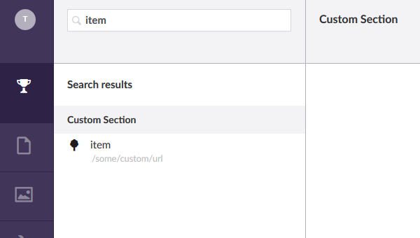

## Search

Adding support for the search bar in the Umbraco backoffice will make your custom
section work a lot easier, as users can	quickly find stuff in your section, even
when they are not navigated to your section. The search bar will search in all sections at 
the same time, so it will display search results from multiple different custom sections
at the same time.

To include support for the search bar is quite easy. However, because of the way the 
search bar is currently implemented in Umbraco, it will require you to create your 
own custom search result formatter, or accept the given editor path structure defined by 
an existing formatter. And, since the current implementation does not support dependency
injection, it will try to instantiate your custom search controller using the default 
constructor, so any DI will be ignored. 

In order to support search, two things are required: adding a `SearchableTree` 
attribute to the controller, and have that controller implement `ISearchableTree`. 
I have added these two things to my `CustomTreeController`, which will result 
in something like this:

``` CSharp
using System.Net.Http.Formatting;
using umbraco.BusinessLogic.Actions;
using Umbraco.Web.Models.Trees;
using Umbraco.Web.Mvc;
using Umbraco.Web.Search;
using Umbraco.Web.Trees;

namespace UmbracoCustomSection.App_Plugins.CustomSection.Controllers
{
    [Tree("customSection", "customTree", "Custom Section", iconClosed: "icon-tree", iconOpen: "icon-trophy")]
    [SearchableTree("searchResultFormatter", "configureContentResult")]
    [PluginController("CustomSection")]
    public class CustomTreeController : TreeController, ISearchableTree
    {
        /* .. */
    }
}
```

Both the attribute and the interface live in  the `Umbraco.Web.Search` namespace, so we need to
start `using` that namespace. 

The `SearchableTree` attribute takes two arguments, both are related to which formatting function is
used to format the search results in the front-end, using a part of the angular
front-end application. I am using the same formatter as the one that is being used
for display content results, and others can be found [here](https://github.com/umbraco/Umbraco-CMS/blob/e0025db56d52b770d2b3aedbd48a3b804fd15ef0/src/Umbraco.Web.UI.Client/src/common/services/searchresultformatter.service.js).
Please keep in mind that this formatter forces you to use the custom page structure
dictated by [this line](https://github.com/umbraco/Umbraco-CMS/blob/e0025db56d52b770d2b3aedbd48a3b804fd15ef0/src/Umbraco.Web.UI.Client/src/common/services/searchresultformatter.service.js#L11). 
You can, of course, implement your own formatter and use that one, and I recommend
you to do so. Since this requires you to setup some custom services in Angular, 
I will show how this is done in the Custom Pages chapter.

The `ISearchableTree` interface requires you to implement the following function, which is quite similair 
to the `GetMenuForNode` or `GetTreeNodes` methods:

``` Csharp
public IEnumerable<SearchResultItem> Search(string query, int pageSize, long pageIndex, out long totalFound, string searchFrom = null)
{
    // do search
}
```

Since we are still hard-coding everything and have not setup any database,
I will keep this method simple to demonstrate the basic idea:

``` Csharp
public IEnumerable<SearchResultItem> Search(string query, int pageSize, long pageIndex, out long totalFound, string searchFrom = null)
{
    totalFound = 1;

    var results = new List<SearchResultItem>();

    var item = new SearchResultItem
    {
        Icon = "icon-tree",
        Id = "1",
        Name = query,
        ParentId = -1,
        Path = $"-1,1",
        Score = 0.5f
    };
    item.AdditionalData.Add("Url", "/some/custom/url");

    results.Add(item);

    return results;
}
```

Rebuilding and restarting Umbraco will give you something like this:



You are supposed to implement the pagination of search results correctly, but since
I only return a single search result I did not bother to do so. Because
this method is called almost everytime the user enters a new character, caching
the results can be beneficial for performance. 

Your search results will be grouped under a single node of which the title is defined by the
title argument specified in the controller's `Tree` attibute. The icon and name of each element
work the same as a menu or tree item. For each search result item you have to specify
it's id and path, which can be used in the front-end to locate the corresponding resource.

Please note the additional data I provide for this item, and especialy why I have chosen
to include `Url`. This piece of data is used by [my search formatter as sub title](https://github.com/umbraco/Umbraco-CMS/blob/e0025db56d52b770d2b3aedbd48a3b804fd15ef0/src/Umbraco.Web.UI.Client/src/common/services/searchresultformatter.service.js#L13).
In your own custom search result provider you can use this, or any of the included meta
data from your search controller to specify the correct path for the resource. You can
align this path with the paths given by the `GetTreeNodes` or `GetMenuForNode`, so
everything will work correctly. In the Custom Section chapter I will demonstrate this.

## Next

Next we will implement DI to make our custom section's backend work just like a regular
WebApi application.