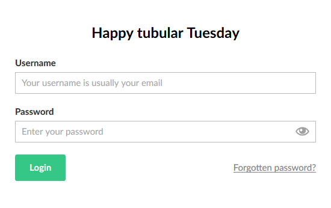
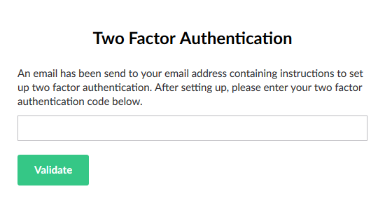
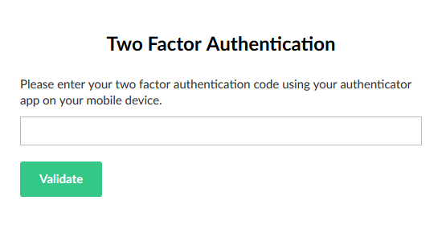
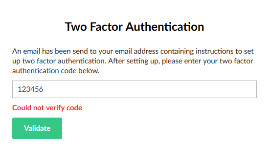

[Back to index](index.md)

## Basic Two Factor Authentication

Since Umbraco relies on Owin and ASP.NET Identity, modifying
the login flow is relatively easy. Adding Two Factor Authentication is quite
simple and really adds an extra level of security to your Umbraco.

There is a seperate [2FA plugin available](https://github.com/Offroadcode/Umbraco-2FA)
in the Packages page in the Developer section, but it's broken since
version 7.7, so not really an option. And, since custom sections
often come with some specific needs, it's best to clearly demonstrate
the absolute basics of getting 2FA to work in Umbraco.

### Nuget package

Before we can begin, we first need to include one NuGet package for
validating 2FA codes and generating QR codes. It is called `TwoFactorAuth.Net`,
which is an [open source package](https://github.com/RobThree/TwoFactorAuth.Net) and
available on NuGet. 

### Owin Startup

After installing the package, we start by replacing the default `UmbracoDefaultOwinStartup`
by our own, with some changes. Start out by creating a `CustomSectionOwinStartup.cs` in
the `Startup` folder, with two overrides. These overrides will be implemented later:

```cs
using Microsoft.Owin;
using Owin;
using Umbraco.Web;
using UmbracoCustomSection.App_Plugins.CustomSection.Startup;

[assembly: OwinStartup("CustomSectionOwinStartup", typeof(CustomSectionOwinStartup))]
namespace UmbracoCustomSection.App_Plugins.CustomSection.Startup
{
    public class CustomSectionOwinStartup : UmbracoDefaultOwinStartup
    {
        protected override void ConfigureServices(IAppBuilder app)
        {
            base.ConfigureServices(app);
        }

        protected override void ConfigureUmbracoAuthentication(IAppBuilder app)
        {
            base.ConfigureUmbracoAuthentication(app);
        }
    }
}
```

This class extends the base [`UmbracoDefaultOwinStartup`](https://github.com/umbraco/Umbraco-CMS/blob/dev-v7.8/src/Umbraco.Web/UmbracoDefaultOwinStartup.cs)
of Umbraco. It's good to keep an eye on this file when adding custom functionality
to the Umbraco authorization since the base implementation can sometimes cause conflicts.

In `web.config`, update the setting:

``` xml
<add key="owin:appStartup" value="UmbracoDefaultOwinStartup" />
```

To:

``` xml
<add key="owin:appStartup" value="CustomSectionOwinStartup" />
```

This tells Umbraco to use our Owin Startup class. After building and restarting Umbraco
the CMS should still work without any noticable change.

### Extending more Umbraco classes

After extending `UmbracoDefaultOwinStartup`, we need to do the same to the
`BackOfficeUserManager`, and extend it with some extra interfaces and methods.

First, create `CustomBackOfficeUserStore.cs` in the `UserManagement` folder of our 
custom section:

```cs
using System.Threading.Tasks;
using Umbraco.Core.Models.Identity;
using Umbraco.Core.Security;
using Umbraco.Core.Services;

namespace UmbracoCustomSection.App_Plugins.CustomSection.UserManagement
{
    public class CustomBackOfficeUserStore : BackOfficeUserStore
    {
        public CustomBackOfficeUserStore(IUserService userService, IEntityService entityService, IExternalLoginService externalLoginService, MembershipProviderBase usersMembershipProvider)
            : base(userService, entityService, externalLoginService, usersMembershipProvider)
        {
        }

        /// <summary>
        /// Override to support setting whether two factor authentication is enabled for the user
        /// </summary>
        /// <param name="user"/><param name="enabled"/>
        /// <returns/>
        /// <remarks>
        /// Two factor authentication is always enabled and cannot be deactivated.
        /// </remarks>
        public override Task SetTwoFactorEnabledAsync(BackOfficeIdentityUser user, bool enabled)
        {
            user.TwoFactorEnabled = true;
            return Task.FromResult(0);
        }

        /// <summary>
        /// Returns whether two factor authentication is enabled for the user
        /// </summary>
        /// <param name="user"/>
        /// <returns/>
        /// <remarks>
        /// Two factor authentication is always enabled and cannot be deactivated.
        /// </remarks>
        public override Task<bool> GetTwoFactorEnabledAsync(BackOfficeIdentityUser user)
        {
            return Task.FromResult(true);
        }
    }
}
```

This user store overrides the default store, and always enables two factor authentication
for every user. You can ofcourse change this behaviour and make it configurable, but that is
all up to you. 

After that, create `CustomBackOfficeUserManager.cs`, also in the `UserManagement` folder:

```cs
using Microsoft.AspNet.Identity;
using Microsoft.AspNet.Identity.Owin;
using Microsoft.Owin;
using Umbraco.Core;
using Umbraco.Core.Configuration;
using Umbraco.Core.Models.Identity;
using Umbraco.Core.Security;
using Umbraco.Web;
using Umbraco.Web.Security.Identity;
using UmbracoCustomSection.App_Plugins.CustomSection.TwoFactorProviders;

namespace UmbracoCustomSection.App_Plugins.CustomSection.UserManagement
{
    class CustomBackOfficeUserManager : BackOfficeUserManager, IUmbracoBackOfficeTwoFactorOptions
    {
        public CustomBackOfficeUserManager(IUserStore<BackOfficeIdentityUser, int> store) : base(store)
        {
        }

        /// <summary>
        /// Creates a BackOfficeUserManager instance with all default options and the default BackOfficeUserManager 
        /// </summary>
        /// <param name="options"></param>
        /// <param name="userService"></param>
        /// <param name="externalLoginService"></param>
        /// <param name="membershipProvider"></param>
        /// <returns></returns>
        public static CustomBackOfficeUserManager Create(IdentityFactoryOptions<CustomBackOfficeUserManager> options, ApplicationContext applicationContext)
        {
            var membershipProvider = MembershipProviderExtensions.GetUsersMembershipProvider().AsUmbracoMembershipProvider();

            var userService = applicationContext.Services.UserService;
            var entityService = applicationContext.Services.EntityService;
            var externalLoginService = applicationContext.Services.ExternalLoginService;

            var contentSectionConfig = UmbracoConfig.For.UmbracoSettings().Content;

            var manager = new CustomBackOfficeUserManager(new CustomBackOfficeUserStore(userService, entityService, externalLoginService, membershipProvider));

            manager.InitUserManager(manager, membershipProvider, options.DataProtectionProvider, contentSectionConfig);

            manager.RegisterTwoFactorProvider("DefaultProvider", new DefaultTwoFactorProvider(options.DataProtectionProvider.Create("DefaultProvider")));

            return manager;
        }

        /// <summary>
        /// Override to return true
        /// </summary>
        public override bool SupportsUserTwoFactor
        {
            get { return true; }
        }

        /// <summary>
        /// Return the view for the 2FA screen
        /// </summary>
        /// <param name="owinContext"></param>
        /// <param name="umbracoContext"></param>
        /// <param name="username"></param>
        /// <returns></returns>
        public string GetTwoFactorView(IOwinContext owinContext, UmbracoContext umbracoContext, string username)
        {
            var user = ApplicationContext.Current.Services.UserService.GetByUsername(username);

            // TODO: determine whether 2FA has been setup
            var userSetup = false;

            if (userSetup)
            {
                return "/App_Plugins/CustomSection/backoffice/twoFactor/twoFactorLogin.html";
            }
            else
            {
                return "/App_Plugins/CustomSection/backoffice/twoFactor/twoFactorEmail.html";
            }
        }
    }
}
```

`CustomBackOfficeUserManager` is a small modification of BackOfficeUserManager; it registers a
`TwoFactorProvider` called `DefaultTwoFactorProvider` to the manager, and overrides `SupportsUserTwoFactor`
to always return true. 

This class also adds the `IUmbracoBackOfficeTwoFactorOptions` interface to the `BackOfficeUserManager`,
which requires exposing the `GetTwoFactorView` method. This methods returns an absolute path
to the view tasked with handling the front-end of the 2FA flow. Just as the previous class,
you should change this method to have it contain some logic which determines if the 2FA for the
current user has been set up.

### Default Provider

To validate any 2FA codes, we need to add a `DataProtectorTokenProvider` in the shape of
`DefaultTwoFactorProvider`. Create `DefaultTwoFactorProvider.cs` in the `TwoFactorProviders` folder:

```cs
using Microsoft.AspNet.Identity;
using Microsoft.AspNet.Identity.Owin;
using Microsoft.Owin.Security.DataProtection;
using System.Threading.Tasks;
using TwoFactorAuthNet;
using Umbraco.Core.Models.Identity;

namespace UmbracoCustomSection.App_Plugins.CustomSection.TwoFactorProviders
{
    public class DefaultTwoFactorProvider : DataProtectorTokenProvider<BackOfficeIdentityUser, int>, IUserTokenProvider<BackOfficeIdentityUser, int>
    {
        public DefaultTwoFactorProvider(IDataProtector protector) : base(protector)
        {
        }

        Task<bool> IUserTokenProvider<BackOfficeIdentityUser, int>.IsValidProviderForUserAsync(UserManager<BackOfficeIdentityUser, int> manager, BackOfficeIdentityUser user)
        {
            return Task.FromResult(true);
        }

        Task<bool> IUserTokenProvider<BackOfficeIdentityUser, int>.ValidateAsync(string purpose, string token, UserManager<BackOfficeIdentityUser, int> manager, BackOfficeIdentityUser user)
        {
            var tfa = new TwoFactorAuth("CustomSection");

            return Task.FromResult(tfa.VerifyCode("XANIK3POC23RCRYN", token));
        }
    }
}
```

This class needs to do two things: determine whether the provider is valid for the user currently 
trying to sign in, and validate the 2FA code provided by the user. Since it is the default, it is 
always valid for any user. Validating the 2FA code is done using the `TwoFactorAuth.Net` package 
we have included earlier. I have reduced as much as possible, and only provided the simplest 
implementation possible, hardcoding the user secret and `TwoFactorAuth` configuration. 


[The GitHub page](https://github.com/RobThree/TwoFactorAuth.Net) of `TwoFactorAuth.Net` provides a 
decent introduction in how to manage user secrets and generating QR codes. We usually have another
database set up where we store extra user information and thus also these user secrets.

For easy set up, I have used the same secret and QR code as on the example page of the 
`TwoFactorAuth.Net` package, so use an Authenticator app to scan the following QR code:


### Front-end

In order to provide a nice UI for the 2FA flow, we need to add two html files and an Angular controller.
You really need to have [Custom Pages](custom.md) set up correctly prior to this. 

First, add `twoFactorLogin.html` in the folder `App_Plugins/CustomSection/backoffice/twoFactor`:

``` html
<div ng-controller="TwoFactorLoginController">
    <div id="twoFactorlogin" class="umb-modalcolumn umb-dialog" ng-cloak>
        <div class="login-overlay__logo">
            
        </div>
        <div class="umb-login-container">
            <div class="form">
                <h1>Two Factor Authentication</h1>
                <div ng-if="step=='loading'">
                    <p>Loading</p>
                </div>
                <div ng-if="step=='code'">
                    <p>Please enter your two factor authentication code using your authenticator app on your mobile device.</p>
                    <form method="POST" name="twoFactorCodeForm" ng-submit="validate(provider, code)" ng-if="step=='code'">
                        <div class="control-group">
                            <input type="text" name="code" class="-full-width-input" ng-class="{error: didFail}" ng-model="code" />
                            <div ng-if="didFail" class="text-error">{{errorMsg}}</div>
                        </div>
                        <button type="submit" class="btn btn-success">Validate</button>
                    </form>
                </div>
            </div>
        </div>
    </div>
</div>
```

Second, add `twoFactorEmail.html` next to it:

``` html
<div ng-controller="TwoFactorLoginController">
    <div id="twoFactorlogin" class="umb-modalcolumn umb-dialog" ng-cloak>
        <div class="login-overlay__logo">
            
        </div>
        <div class="umb-login-container">
            <div class="form">
                <h1>Two Factor Authentication</h1>
                <div ng-if="step=='loading'">
                    <p>Loading</p>
                </div>
                <div ng-if="step=='code'">
                    <p>An email has been send to your email address containing instructions to set up two factor authentication. After setting up, please enter your two factor authentication code below.</p>
                    <form method="POST" name="twoFactorCodeForm" ng-submit="validate(provider, code)" ng-if="step=='code'">
                        <div class="control-group">
                            <input type="text" name="code" class="-full-width-input" ng-class="{error: didFail}" ng-model="code" />
                            <div ng-if="didFail" class="text-error">{{errorMsg}}</div>
                        </div>
                        <button type="submit" class="btn btn-success">Validate</button>
                    </form>
                </div>
            </div>
        </div>
    </div>
</div>
```

These pages are almost identical, but I wanted to demonstrate that is possible to have different
pages in the login flow, depending on the user state. The `CustomBackOfficeUserManager.GetTwoFactorView`
method in the backend determines which page is displayed to the user.

After these to html pages, add `two-factor-login-controller.js` in `App_Plugins/CustomSection/backoffice/controllers`:

``` js
angular.module("umbraco").controller("TwoFactorLoginController",
    function ($scope, $cookies, localizationService, userService, externalLoginInfo, resetPasswordCodeInfo, $timeout, authResource, dialogService) {

        $scope.code = "";
        $scope.provider = "";
        $scope.providers = [];
        $scope.step = "loading";
        $scope.didFail = false;
        $scope.errorMsg = "";
        authResource.get2FAProviders()
            .then(function (data) {
                var provider = data[0];
                $scope.provider = provider;
                authResource.send2FACode(provider)
                    .then(function () {
                        $scope.step = "code";
                    });
            });
        
        $scope.validate = function (provider, code) {
            $scope.didFail = false;
            $scope.code = code;
            authResource.verify2FACode(provider, code)
                .then(function (data) {
                    userService.setAuthenticationSuccessful(data);
                    $scope.submit(true);
                },
                function (reason) {
                    console.log("didFail", reason);
                    $scope.didFail = true;
                    $scope.errorMsg = reason.errorMsg;
                });
        };
    });
```

Do not forget to reference this javascript file in [`package.manifest`](custom_angular.md)!

### Almost done

We are almost done, we only need to tell Umbraco to use our stuff instead of the default, by 
modifying `CustomSectionOwinStartup.cs`:

```cs
public class CustomSectionOwinStartup : UmbracoDefaultOwinStartup
{
    protected override void ConfigureServices(IAppBuilder app)
    {
        app.SetUmbracoLoggerFactory();

        var applicationContext = ApplicationContext.Current;

        // Configure customized user manager
        app.ConfigureUserManagerForUmbracoBackOffice<CustomBackOfficeUserManager, BackOfficeIdentityUser>(
            applicationContext,
            (options, context) =>
            {
                return CustomBackOfficeUserManager.Create(options, applicationContext);
            });
    }

    protected override void ConfigureUmbracoAuthentication(IAppBuilder app)
    {
        base.ConfigureUmbracoAuthentication(app);

        app.UseTwoFactorSignInCookie(Constants.Security.BackOfficeTwoFactorAuthenticationType, TimeSpan.FromMinutes(5));
    }
}
```

Log out from Umbraco, rebuild Umbraco and restart the site. The login flow should look similair
to this:

#### A regular login page:


#### The 2FA page when the user has not set up 2FA completely:


#### The 2FA page when the user has set up 2FA:


#### Code validation works:


## Next

Next step is to interface with an Azure AD or ADFS system, which allows us to add SSO to Umbraco
and have our users sign in with their Windows / AD account. So no more endless amounts of seperate
accounts for every little CMS that is build, but a single account giving access securely to everthing
the user needs.