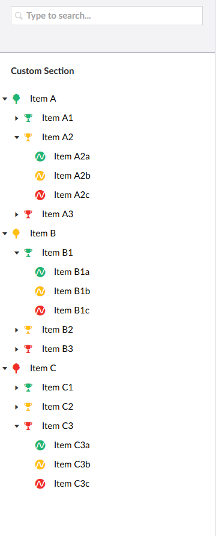

## Tree

In order to add functionality your custom section, you can start by adding a custom tree. 
You can create your own tree by creating a `CustomTreeController` derived from `TreeController`. 
The TreeControllers are used by Umbraco to generate trees for each section, and have two methods
which must be overridden. The TreeController is a bit of an oldie, and does not support anything 
`async`. This TreeController will probably be replaced by something better in Umbraco 8.x, but it
will have to do for now. The most simplistic implementation of `Controllers/CustomTreeController.cs` will
look something like this:

``` Csharp
using System.Net.Http.Formatting;
using Umbraco.Web.Models.Trees;
using Umbraco.Web.Mvc;
using Umbraco.Web.Trees;

namespace UmbracoCustomSection.App_Plugins.CustomSection.Controllers
{
	[Tree("customSection", "customTree", "Custom Section", iconClosed: "icon-tree", iconOpen: "icon-trophy")]
	[PluginController("CustomSection")]
	public class CustomTreeController : TreeController
	{
		protected override TreeNodeCollection GetTreeNodes(string id, FormDataCollection queryStrings)
		{
			return new TreeNodeCollection();
		}

		protected override MenuItemCollection GetMenuForNode(string id, FormDataCollection queryStrings)
		{
			return new MenuItemCollection();
		}
	}
}
```

There are two methods on the controller, `GetTreeNodes` and `GetMenuForNode`. The first method is for 
outputing tree nodes to build up the tree, the second one is for outputing menu items for the context menu
of each tree node.

After building and restarting the site, the corresponding tree will look something like this:


Notice that the configuration in `config/trees.config` has been extended with a new item:

``` xml
<add initialize="true" sortOrder="0" alias="customTree" application="customSection" title="Custom Section" iconClosed="icon-tree" iconOpen="icon-trophy" type="UmbracoCustomSection.App_Plugins.CustomSection.Controllers.CustomTreeController, UmbracoCustomSection" />
```

The config from the TreeAttribute has been used to create this new node, although the `iconClosed`
and `iconOpen` attributes are not used anymore in the UI. 

The `GetTreeNodes` method is called everytime a user clicks on the little arrow on a menu item, by
which the `id` argument contains the id of the corresponding tree node. The root node has `-1` as id,
so it is easy to identify the root node. 

I have hard coded some menu items to demonstrate this mechanism:

``` Csharp
protected override TreeNodeCollection GetTreeNodes(string id, FormDataCollection queryStrings)
{
	var collection = new TreeNodeCollection();

	if (id == "-1")
	{
		collection.Add(CreateTreeNode("A", "-1", queryStrings, "Item A", "icon-tree color-green", true));
		collection.Add(CreateTreeNode("B", "-1", queryStrings, "Item B", "icon-tree color-yellow", true));
		collection.Add(CreateTreeNode("C", "-1", queryStrings, "Item C", "icon-tree color-red", true));
	}
	else if (id.Length == 1)
	{
		collection.Add(CreateTreeNode($"{id}1", id, queryStrings, $"Item {id}1", "icon-trophy color-green", true));
		collection.Add(CreateTreeNode($"{id}2", id, queryStrings, $"Item {id}2", "icon-trophy color-yellow", true));
		collection.Add(CreateTreeNode($"{id}3", id, queryStrings, $"Item {id}3", "icon-trophy color-red", true));
	}
	else if (id.Length == 2)
	{
		collection.Add(CreateTreeNode($"{id}1", id, queryStrings, $"Item {id}a", "icon-stream color-green", false));
		collection.Add(CreateTreeNode($"{id}2", id, queryStrings, $"Item {id}b", "icon-stream color-yellow", false));
		collection.Add(CreateTreeNode($"{id}3", id, queryStrings, $"Item {id}c", "icon-stream color-red", false));
	}

	return collection;
}
```

This results in the following tree:



The `CreateTreeNode` method I have used takes the following arguments:

``` Csharp
CreateTreeNode(string id, string parentId, FormDataCollection queryStrings, string title, string icon, bool hasChildren);
```

The most usefull arguments are `title` and `icon`, which is used on the menu item, and `hasChildren`, which determines
if a little arrow must be drawn in front of the menu item. Note that toe third level menu items in the previous screenshot
do not have such an arrow. 

There is also an overload which taks the following arguments:

``` Csharp
CreateTreeNode(string id, string parentId, FormDataCollection queryStrings, string title, string icon, bool hasChildren, string routePath);
```

This overload takes `routePath` as additional argument and is very important for the routing when using custom pages. 
How this works is explained in the Custom pages chapter. 

The `GetMenuForNode` is called when the user clicks on the tree dots of a tree node, which opens a context menu with
extra options. Since the current implementation returns an empty collection, the menu looks like this:


The way this method is used is quite similair to the `CreateTreeNodes` method, it will be called when the user
opens the context menu, and the `id` argument will have the id of the corresponding tree node. There are some default 
features which you can tap into:

``` Csharp
protected override MenuItemCollection GetMenuForNode(string id, FormDataCollection queryStrings)
{
	var collection = new MenuItemCollection();

	if(id == "-1")
	{
		var item = new MenuItem("edit", "Edit");
		item.NavigateToRoute("/some/route");
		collection.Items.Add(item);
	}
	else if(id.Length == 1)
	{
		collection.Items.Add<ActionSort>("Custom Sort").LaunchDialogView("/App_Plugins/CustomSection/backoffice/customTree/dialog.html", "Custom Dialog");
	}
	else if(id.Length == 2)
	{
		collection.Items.Add<ActionNew>("Create").NavigateToRoute("/customSection/customTree/customPage/edit");
	}

	collection.Items.Add<ActionRefresh>("Reload", true);

	return collection;
}
```


As you can see, you can add completely custom `MenuItem`s, lauch custom dialogs, navigate to routes, or refresh
the tree node list. There are quite a few `Action`s available, and you can create custom Actions aswell. The
`NavigateToRoute` and `LaunchDialogView` are discussed in the Custom Pages chapter, as they required the same
setup as a custom page. 

## Next

Now that we have a basic implementation of our TreeController, we can almost start with creating some 
custom pages and add some functionality to our custom section. But first, we need to register our tree
as `SearchableTree` to have the search box above the tree also search in our section:


And we have to get our Dependency Injection working, so we can really start using some services and start
talking to a database. And getting Entity Framework Core working inside Umbraco can be a bit of a hassle,
so that needs to be taken care of first.